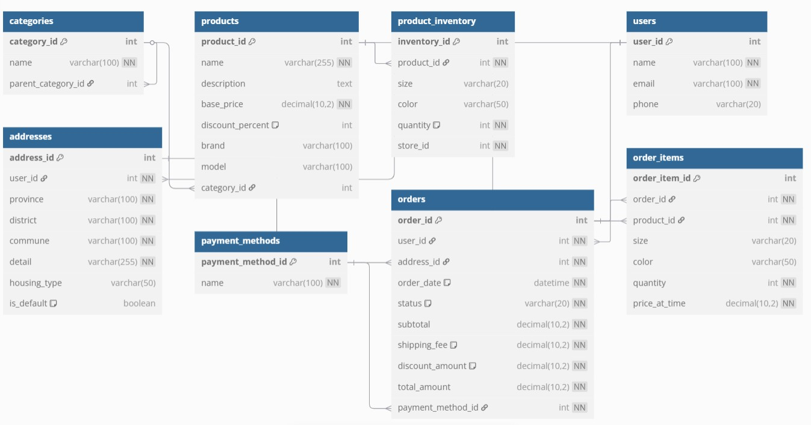

# E-commerce Database Design & Normalization

## Overview

Based on the images provided in the assessment, I've designed a simplified relational database to store information for an e-commerce platform. The database captures essential entities such as products, categories, users, addresses, orders, and inventory while maintaining proper normalization.

## Database Schema Diagram

## Database Schema

### Tables and Relationships

1. **categories**
   - Stores product categories with self-referential relationship for hierarchical categorization
   - Fields: category_id, name, parent_category_id

2. **products**
   - Stores product information including pricing and basic details
   - Fields: product_id, name, description, base_price, discount_percent, brand, model, category_id

3. **product_inventory**
   - Tracks product availability across different sizes, colors, and stores
   - Fields: inventory_id, product_id, size, color, quantity, store_id

4. **users**
   - Stores customer information
   - Fields: user_id, name, email, phone

5. **addresses**
   - Stores shipping addresses for users
   - Fields: address_id, user_id, province, district, commune, detail, housing_type, is_default

6. **payment_methods**
   - Available payment options
   - Fields: payment_method_id, name

7. **orders**
   - Stores order header information
   - Fields: order_id, user_id, address_id, order_date, status, subtotal, shipping_fee, discount_amount, total_amount, payment_method_id

8. **order_items**
   - Stores individual items within an order
   - Fields: order_item_id, order_id, product_id, size, color, quantity, price_at_time

## Database Normalization Used

### First Normal Form (1NF)
- All tables have primary keys
- Each column contains atomic (indivisible) values
- No repeating groups of data
  
**Example:** Instead of storing multiple product sizes or colors in a single field, we created separate records in the product_inventory table.

### Second Normal Form (2NF)
- Meets all requirements of 1NF
- All non-key attributes are fully dependent on the primary key
  
**Example:** Order items are stored in a separate table (order_items) since they depend on both the order and the product.

### Third Normal Form (3NF)
- Meets all requirements of 2NF
- No transitive dependencies (non-key attributes don't depend on other non-key attributes)
  
**Example:** User information is separated from address information, and payment methods are in their own table.

## Design Decisions

1. **Simplified Product Variants:** 
   Instead of creating a separate product variants table, I stored size and color directly in the inventory and order items tables to simplify the schema while still capturing the necessary information.

2. **Hierarchical Categories:**
   Categories can have parent categories, enabling the hierarchical organization shown in the screenshots (like "Giày thời trang" being a subcategory).

3. **Order Pricing:**
   The order tracks subtotal, shipping fees, and discounts separately to match the checkout process shown in the screenshots.

4. **Direct Address Association:**
   Addresses are linked directly to users rather than creating a junction table, as this simplifies the schema while still meeting requirements.

This simplified schema satisfies the requirements for an e-commerce system while maintaining appropriate normalization and minimizing complexity, making it suitable for an internship-level project.
